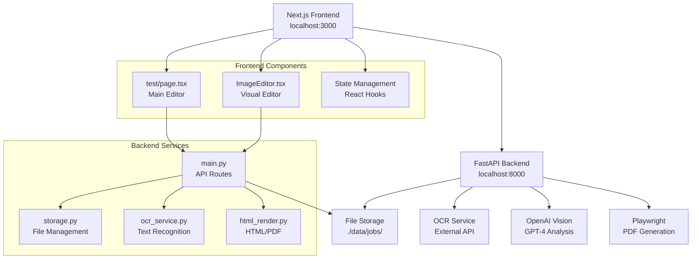
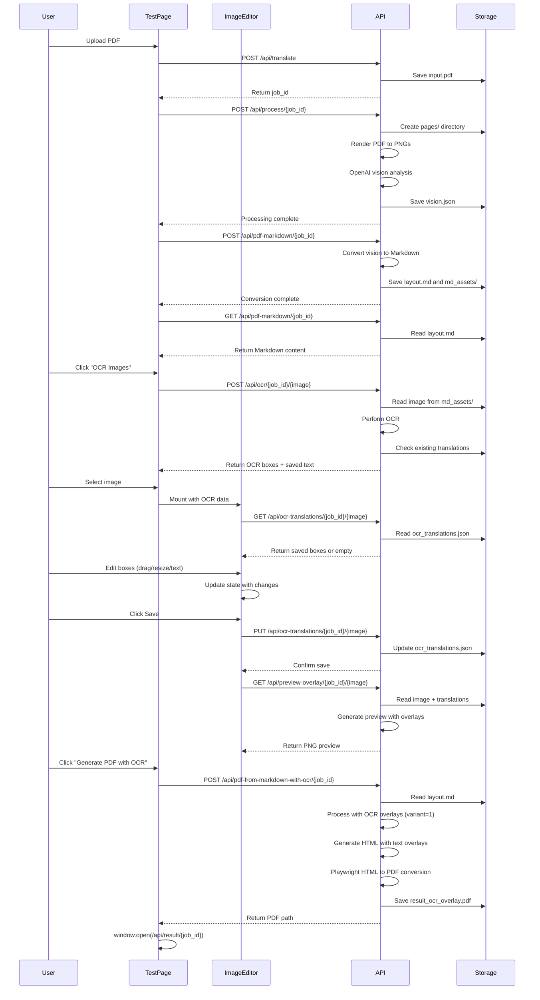
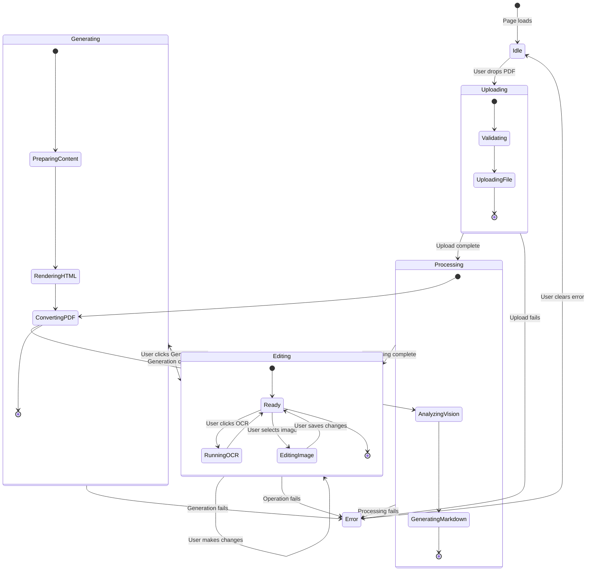
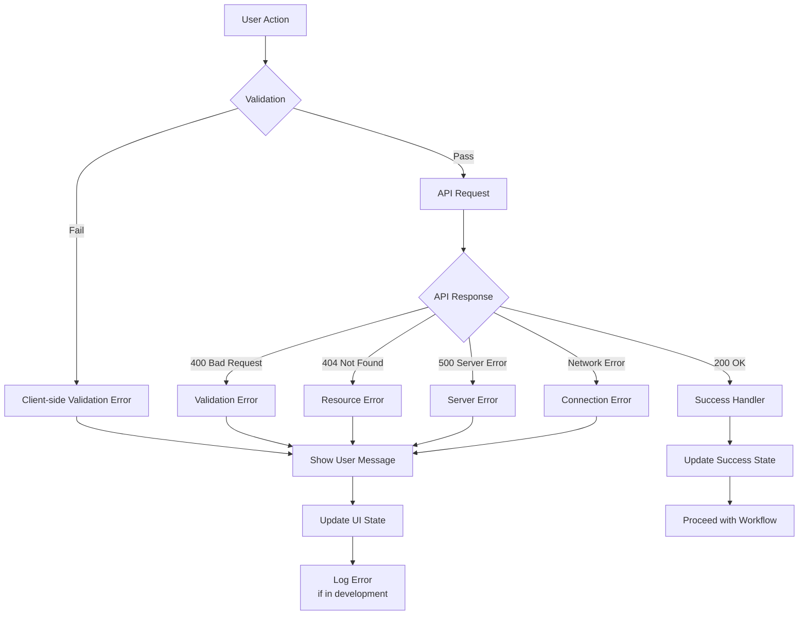
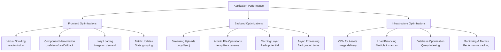

# PDF Translator Architecture Diagrams

## System Architecture Overview



## Data Flow Architecture

```mermaid
flowchart TD
    %% PDF Processing Pipeline
    A[User Uploads PDF] --> B{Validate File}
    B -->|Valid| C[POST /api/translate]
    B -->|Invalid| D[Show Error]
    
    C --> E[Create Job ID]
    E --> F[Save input.pdf]
    F --> G[POST /api/process/{job_id}]
    
    G --> H[Render PDF to PNG]
    H --> I[OpenAI Vision Analysis]
    I --> J[Generate vision.json]
    
    J --> K[POST /api/pdf-markdown/{job_id}]
    K --> L[Convert to Markdown]
    L --> M[Extract Images to md_assets/]
    
    M --> N[GET /api/pdf-markdown/{job_id}]
    N --> O[Load in Editor]
    
    %% OCR Workflow
    O --> P[User clicks OCR Images]
    P --> Q[getImageNamesFromMarkdown()]
    Q --> R[For each image]
    
    R --> S[POST /api/ocr/{job_id}/{image}]
    S --> T[Perform OCR]
    T --> U[Return bounding boxes]
    U --> V[Store in state]
    
    %% Visual Editing
    V --> W[User selects image]
    W --> X[ImageEditor mounts]
    X --> Y[Load saved boxes or init from OCR]
    
    Y --> Z[User edits boxes<br/>- Drag to move<br/>- Resize handles<br/>- Edit text]
    Z --> AA[Click Save]
    AA --> AB[PUT /api/ocr-translations/{job_id}/{image}]
    AB --> AC[Save boxes to JSON]
    
    AC --> AD[Auto-generate preview]
    AD --> AE[GET /api/preview-overlay/{job_id}/{image}]
    AE --> AF[Show preview]
    
    %% PDF Generation
    AF --> AG[User clicks Generate PDF]
    AG --> AH[POST /api/pdf-from-markdown-with-ocr/{job_id}]
    AH --> AI[Process Markdown with OCR]
    AI --> AJ[Generate HTML with overlays]
    AJ --> AK[Playwright HTML→PDF]
    AK --> AL[Open result.pdf in browser]
```

## Component Interaction Diagram



## State Management Flow



## File Storage Structure

```mermaid
graph TD
    A[data/] --> B[jobs/]
    B --> C[{job_id}/]
    C --> D[input.pdf]
    C --> E[job.json]
    C --> F[vision.json]
    C --> G[layout.md]
    C --> H[ocr_translations.json]
    C --> I[result.pdf]
    C --> J[result_ocr_overlay.pdf]
    C --> K[md_assets/]
    C --> L[pages/]
    
    K --> K1[page1_img1.png]
    K --> K2[page1_img2.png]
    K --> K3[...]
    
    L --> L1[page_1.png]
    L --> L2[page_2.png]
    L --> L3[debug_page_1.png]
    
    C --> M[render.html]
    C --> N[document_with_ocr_{job_id}.html]
    C --> O[markdown_for_pdf.md]
    C --> P[markdown_for_ocr_overlay.md]
```

## Coordinate System Transformation

```mermaid
graph LR
    A[Natural Image<br/>Coordinates<br/>(Raw Pixels)] --> B[Screen<br/>Coordinates<br/>(Viewport)]
    B --> C[Scaled<br/>Coordinates<br/>(Display)]

    subgraph "Transformation Process"
        T1[GetBoundingClientRect<br/>img element]
        T2[Calculate Scale Factors<br/>natural vs display size]
        T3[Apply Transformations<br/>with zoom factor]
        T4[Grid Snapping<br/>5px increments]
    end
    
    A --> T1
    T1 --> T2
    T2 --> T3
    T3 --> T4
    T4 --> B
    B --> C
```

## Error Handling Flow



## Performance Optimization Layers



These diagrams provide visual representations of the key architectural patterns, data flows, and component interactions in the PDF Translator `/test` page implementation.